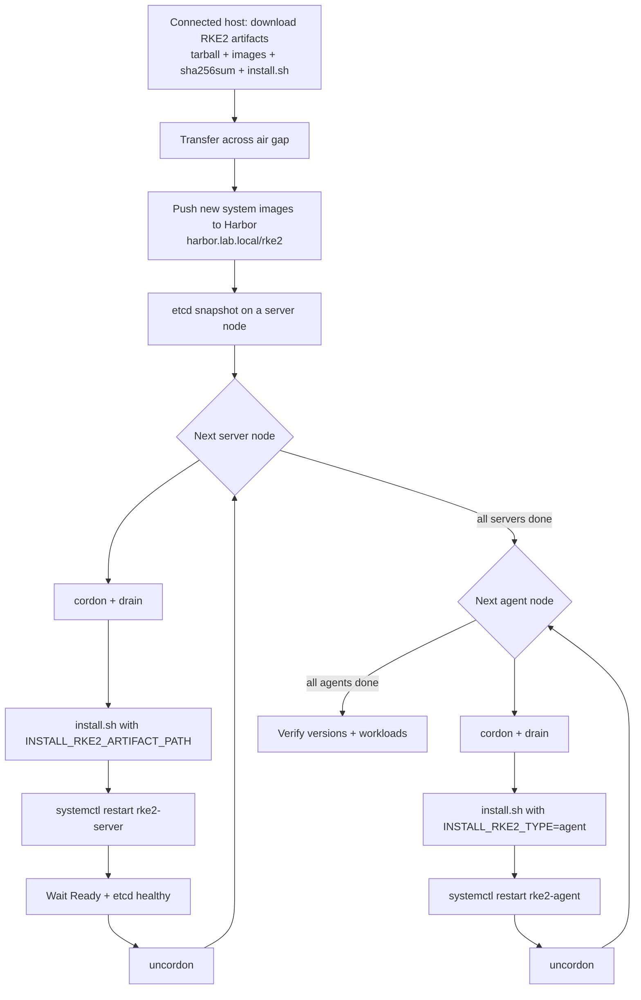
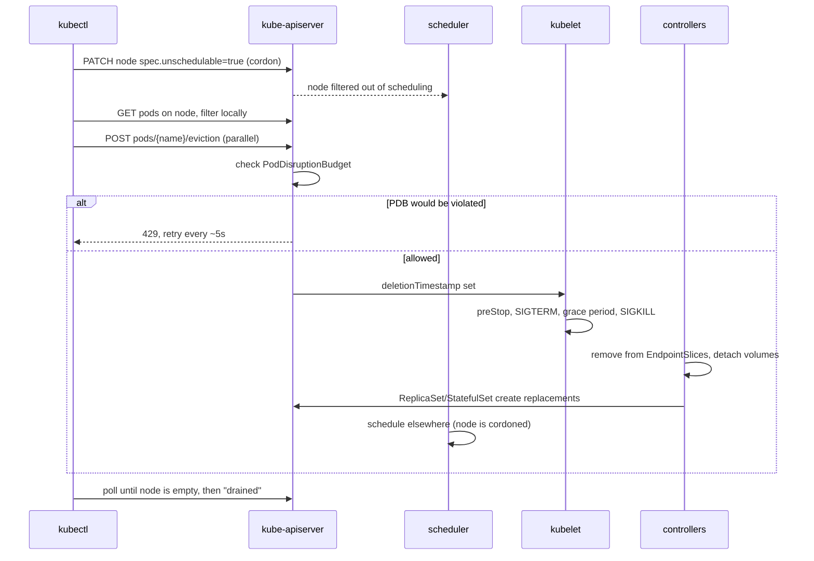

I just finished upgrading an air-gapped RKE2 cluster (3 servers + 2 agents on SLES 16, Harbor as the private registry, kube-vip in front of the API) using the [manual upgrade path](https://docs.rke2.io/upgrades/manual). No System Upgrade Controller, no internet — just binaries copied across the gap and a careful node-by-node rollout.

This post covers three things: the upgrade procedure itself, what actually happens under the hood when you drain a node, and a registry-config lesson I learned along the way.

## The upgrade at a glance



The golden rules: **servers before agents, one node at a time, never skip a minor version**, and always take an etcd snapshot first.

## Step 1 — Stage the artifacts (connected side)

From the RKE2 GitHub release for the target version, grab:

- `rke2.linux-amd64.tar.gz` — the binary tarball
- `rke2-images.linux-amd64.tar.zst` — system images (optional if you serve them from Harbor)
- `sha256sum-amd64.txt` — checksums
- `install.sh` — from `https://get.rke2.io`

Verify checksums, then carry the bundle across the gap to every node, e.g. into `/root/rke2-artifacts/`.

Because my nodes pull system images from Harbor (via `system-default-registry`), the new version's images also need to land in Harbor **before** any node restarts. The release ships an image list (`rke2-images-all.linux-amd64.txt`); mirror those into the `rke2` project. If you skip this, the restarted node will sit there with `ImagePullBackOff` on its own control plane.

## Step 2 — Back up etcd

```bash
rke2 etcd-snapshot save --name pre-upgrade
```

This is your rollback lifeline. Copy the snapshot off the node.

## Step 3 — Upgrade servers, one at a time

```bash
kubectl cordon <server>
kubectl drain <server> --ignore-daemonsets --delete-emptydir-data

# on the node
INSTALL_RKE2_ARTIFACT_PATH=/root/rke2-artifacts sh install.sh
systemctl restart rke2-server

# back on your workstation
kubectl get nodes -w          # wait for Ready + new version
kubectl uncordon <server>
```

Before moving on, confirm etcd membership is healthy and all three API servers answer behind kube-vip. Only then touch the next server.

## Step 4 — Upgrade agents

Same dance, with the agent type:

```bash
INSTALL_RKE2_ARTIFACT_PATH=/root/rke2-artifacts INSTALL_RKE2_TYPE=agent sh install.sh
systemctl restart rke2-agent
```

## What `kubectl drain` actually does

While waiting on a drain that wouldn't finish, I went down the rabbit hole. Key insight: **drain is entirely client-side.** There's no drain object or controller — kubectl just makes ordinary API calls, and the regular pod lifecycle machinery does the work.



The phases in short:

1. **Cordon** — a single PATCH sets `spec.unschedulable: true`. The scheduler stops placing pods there. The kubelet doesn't care.
2. **Enumerate and filter** — kubectl lists the node's pods and decides locally. DaemonSet pods need `--ignore-daemonsets`; static/mirror pods (etcd, kube-apiserver, kube-vip on RKE2 servers) are always skipped; `emptyDir` pods need `--delete-emptydir-data`; unowned pods need `--force`.
3. **Evict** — kubectl uses the *Eviction subresource*, not a plain DELETE. That's what makes PDBs matter: if eviction would break a budget, the API server returns 429 and kubectl retries forever. This is the Longhorn loop many of us have hit.
4. **Terminate** — the kubelet runs preStop hooks, sends SIGTERM, waits `terminationGracePeriodSeconds`, then SIGKILL. In parallel the pod is pulled from Service endpoints (hence the classic `preStop: sleep` trick), and volumes are unmounted and detached so the PVC can attach elsewhere.
5. **Replace** — ReplicaSets create new pods immediately; StatefulSets wait until the old pod is fully gone before recreating the same name, and only once its PVC can move.
6. **Return** — kubectl polls until the node is empty and prints `drained`.

What drain **doesn't** touch: the kubelet, containerd, the CNI, or the static control-plane pods. The node stays `Ready,SchedulingDisabled`. It's the `rke2-server` restart that actually takes those down. And `uncordon` just flips the flag back — it never moves pods back.

## Lesson learned: `system-default-registry` vs `registries.yaml`

During install I'd set this in `config.yaml`:

```yaml
system-default-registry: harbor.lab.local/rke2
```

It works, but for a multi-mirror setup `registries.yaml` is the better tool. They solve different problems:

| | `system-default-registry` | `registries.yaml` |
|---|---|---|
| Implemented by | RKE2 (rewrites image names in its manifests/charts) | containerd (mirror config) |
| Applies to | RKE2 system images only | every pull on the node, workloads included |
| Multiple endpoints / fallback | no, single value | yes, tried in order |
| Path rewrite | no | yes (`rewrite`) |
| Pod specs keep upstream names | no | yes, so config stays portable |

A `registries.yaml` that does the same job with fallback and a Harbor project rewrite:

```yaml
mirrors:
  docker.io:
    endpoint:
      - "https://harbor.lab.local"
      - "https://harbor2.lab.local"
    rewrite:
      "^rancher/(.*)": "rke2/rancher/$1"
  "*":
    endpoint:
      - "https://harbor.lab.local"
configs:
  "harbor.lab.local":
    auth:
      username: robot$rke2-pull
      password: <redacted>
    tls:
      ca_file: /etc/rancher/rke2/harbor-ca.crt
```

(`rewrite` needs a reasonably modern RKE2; the `"*"` wildcard needs v1.25+.)

**Don't switch mid-upgrade.** Changing `system-default-registry` makes RKE2 regenerate static pod manifests with new image names, recreating etcd and the API server — extra churn you don't want during an upgrade. The two settings coexist fine, so finish the upgrade first, then remove `system-default-registry`, add the rewrite rule, and roll through the nodes with the same cordon → restart → uncordon pattern. Remember that `registries.yaml` is only read at startup, so every change needs a service restart.

## Takeaways

- In an air gap, the upgrade is mostly **logistics**: binaries on every node and images in Harbor *before* the first restart.
- Snapshot etcd, go servers first, one node at a time, and verify between each.
- `kubectl drain` is just polite, PDB-respecting evictions. When it hangs, look at your PDBs.
- Use `registries.yaml` for mirrors; keep `system-default-registry` for the simple single-registry case.
